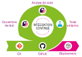

# Tests et intégration continue

Ce dépôt contient un exemple de projet de Web API en Java Springboot utilisable pour mettre en place :
- des tests d'intégration permettant de tester les "endpoints" et l'accès à une base de données
- un pipeline "GitHub action" permettant de lancer la compilation et les tests lors d'un **"merge"** ou d'une **"pull request"** sur la branche **"main"**
- un lien avec [Sonarcloud](https://sonarcloud.io/)

Ceci vous permettra de mettre en place



## Mise en place de l'environnement de développement local

Si vous souhaitez essayer le projet en local vous pourrez suivre les étapes suivantes :
1. Créer la base de données associée au projet en utilisant le fichier de configuration Docker fourni dans le sous-dosse
2. Lancer les tests unitaires (via votre IDE ou en ligne de commande).

## Fichier de configuration du workflow

Le fichier de configuration YAML du "workflow" Github Action nommé `ci.yml` est contenu dans le sous-dossier `.github/workflow`.

Les déclencheurs du Github Action sont déclarées dans le fichier grâce au code suivant :
```yml
# Déclaration des actions après lesquelles les "jobs" vont se déclencher
on:
  push:
    branches: [ "main" ]
  pull_request:
    branches: [ "main" ]
```

Le projet utilise une base de données PostgreSQL. De ce fait le "pipeline" intègre la création d'un conteneur accueillant un SGBD PostgreSQL.

Ceci est fait grâces aux lignes suivantes :
```yml
    services:
      postgres:
        image: postgres:15
        env:
          POSTGRES_USER: postgres
          POSTGRES_PASSWORD: B@nLgU4qz*9?D~3n83
          POSTGRES_DB: account
        ports:
          - 5432:5432
        options: --health-cmd pg_isready --health-interval 10s --health-timeout 5s --health-retries 5
```

Plusieurs étapes sont ensuite effectuées :
- `actions/checkout@v3` : récupération du code provenant du dépôt sur la machine virtuelle ubuntu du Github action
- `actions/setup-java@v3` : installation du JDK Java permettant la compilation (cette action intègre "maven")
- ensemble d'étapes de création de la base de données en fonction des scripts contenus dans le dépôt
- compilation et lancement des tests avec la commande `mvn clean verify`

# Travail à effectuer

En vous inspirant des fichiers de configuration de ce projet il vous est demandé de mettre en place l'intégration continue en utilisant Github Action.

Pour se faire, suivez les étapes suivantes :
1. choisissez un de vos projets Java qui intègre des tests unitaires
2. ajoutez le fichier de configuration "ci.yml" **SANS L'ÉTAPE** propre à Sonarqube afin d'automatiser la phase de tests unitaires
3. suivez les indications données par le `README` contenu dans le sous-dossier `README/sonarcloud`