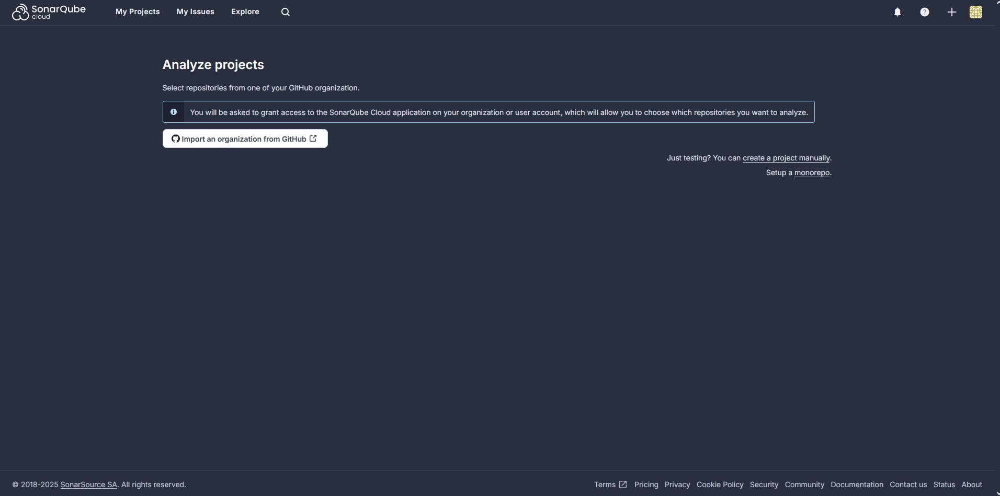
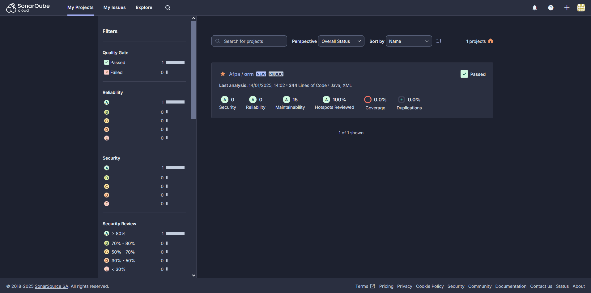

# Etapes pour ajouter Sonarqube Cloud à un workflow

> [!IMPORTANT]  
> Avec la version gratuite de Sonarqube Cloud seuls les projets en "public" peuvent être analysés.

Procédure :
1. se créer un compte sur Sonarcloud
2. faire le lien entre un projet Sonarcloud et un dépôt Github



3. Activer la méthode d'analyse avec Github Action sur le projet :



> [!IMPORTANT]  
> Cette action va créer un token d'accès à Sonarqube. Pour voir tous les tokens créés aller dans l'onglet "Security" de la page "Mon compte".

La page présentant la méthode d'analyse indique les modifications à effectuer sur le projet hébergé sur Git :
- ajouter les propriétés concernant "sonar" dans le fichier `pom.xml`
- ajouter une étape de "Compilation et d'analyse" au fichier "yml" :
```yml
 - name: Build and analyze
        env:
          SONAR_TOKEN: ${{ secrets.SONAR_TOKEN }}
        run: mvn -B verify org.sonarsource.scanner.maven:sonar-maven-plugin:sonar -Dsonar.projectKey=<project-key>
```

4. Ajouter le token en "secret" Github sur le dépôt concerné : il vous faut procéder en 2 temps, d'abord créer un environnement puis lui ajouter un secret.
Cette variable d'environnement secrète doit s'appeler "SONAR_TOKEN"

5. ajouter la définiton de l'environnement dans la configuration du Workflow :
```yml
...
jobs:
  build:
    environment: <nom-environnement>
    runs-on: ubuntu-latest
...
```

Une fois toutes ces tâches effectuées le déclenchement de l'analyse par Sonarqube se fait pour chaque "push" ou "pull request" sur la branche "main".

