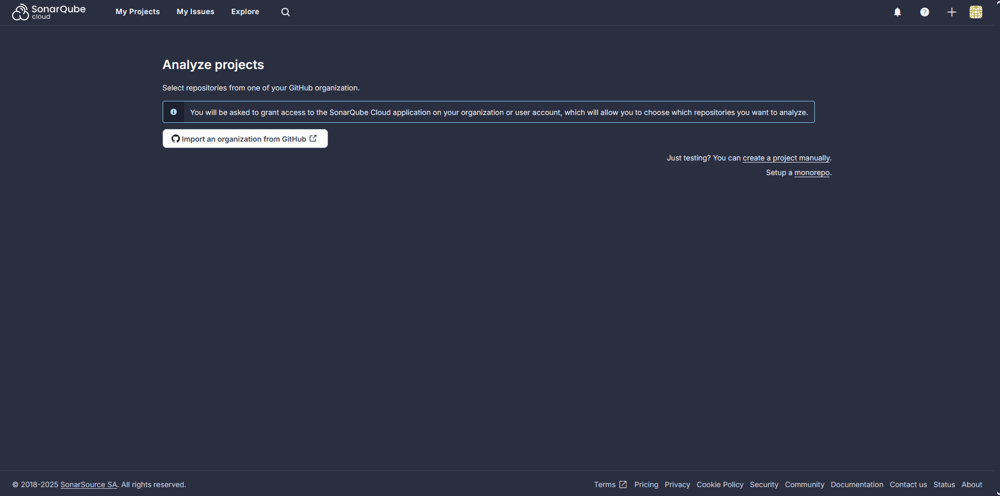
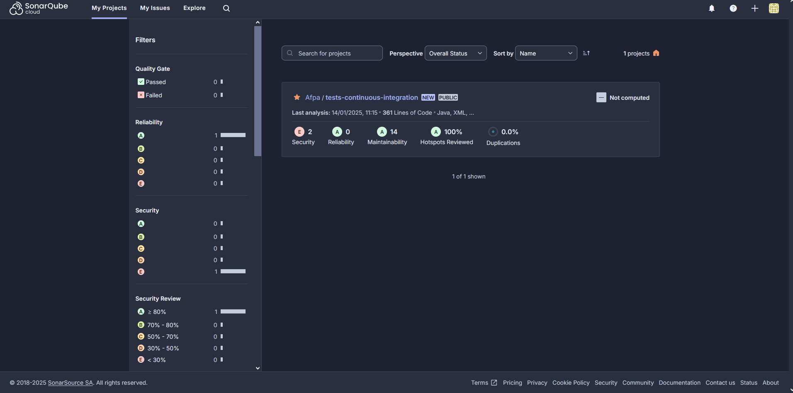
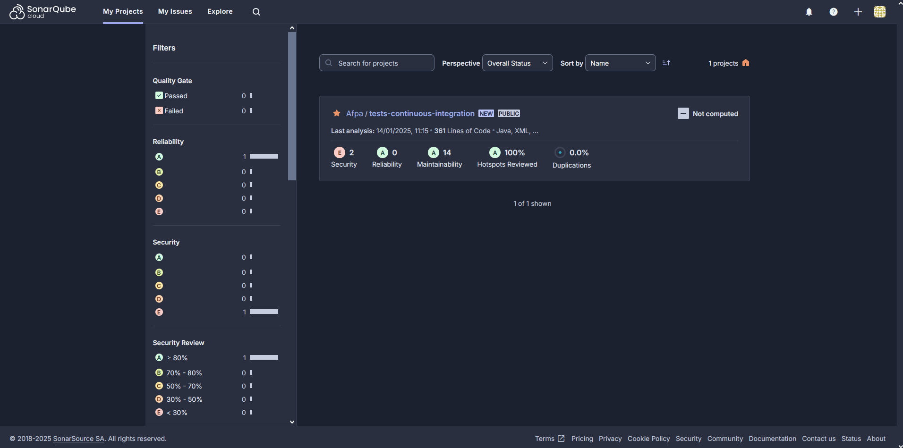

# Etapes pour ajouter Sonarqube Cloud à un workflow

> [!IMPORTANT]  
> Avec la version gratuite de Sonarqube Cloud seuls les projets en "public" peuvent être analysés.

Procédure :
1. se créer un compte sur Sonarcloud
2. faire le lien entre un projet Sonarcloud et un dépôt Github



3. ajout du fichier de configuration `sonar-project.properties` à la racine, exemple de contenu de fichier :
```
sonar.organization=<clé de l'organisation (peut être une utilisateur)>
sonar.projectKey=<clé du projet>
```
Pour retrouver les clés :



4. Créer un token sur Sonarqube Cloud afin que Github puisse entrer en communication :



5. Ajouter le token en "secret" Github sur le dépôt concerné : il vous faut procéder en 2 temps, d'abord créer un environnement puis lui ajouter un secret.
Cette variable d'environnement secrète doit s'appeler "SONAR_TOKEN"

